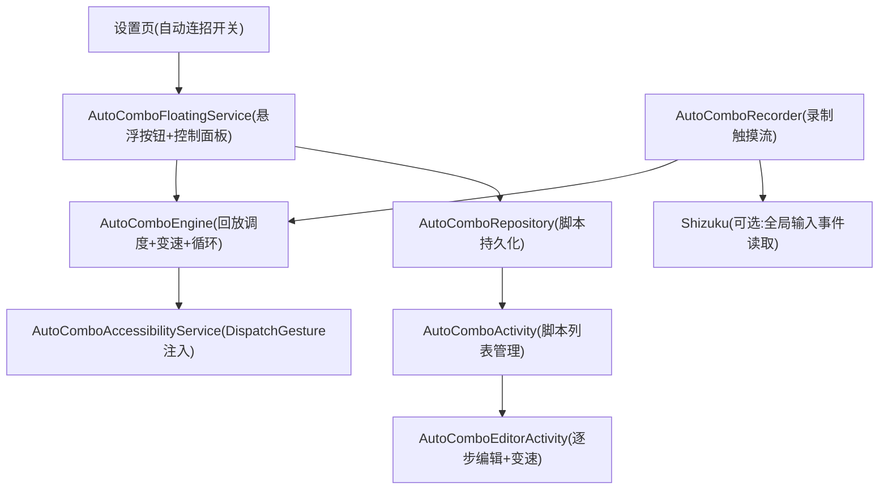

# 自动连招

Feature Name: auto-combo
Updated: 2026-08-21

## Description

在 HanFeng 中加入"自动连招"（对标小米手机游戏工具箱"自动连招"）：全局（不限定应用）录制用户的触摸操作序列（单击/长按/滑动，含坐标、持续时长与间隔），保存为脚本，经独立的连招悬浮球触发回放。入口位于设置页；点按连招悬浮球展开矩形圆角液态玻璃弹窗面板（半透明、渐变高光、背景高斯模糊，与 App 视觉统一），在面板内完成录制、参数修改、脚本切换、播放模式与变速；连招总开关同时支持音量键控制（与弱网音量键共用"音量键快捷功能"动作选择，二选一）。支持多脚本管理、逐步编辑、整体变速、导入导出与单次/指定次数/无限三种循环模式。

## Architecture



说明：
- **回放**：无障碍服务用 `dispatchGesture(GestureDescription)` 注入 tap/longPress/swipe，是全功能核心。
- **录制**：存在系统级限制（第三方 App 无法在让目标应用正常响应的同时直接感知其原始触摸流），按可用能力分为主路径与兜底路径（见"录制路径决策"）。
- 连招悬浮球与现有悬浮球、弱网音量键辅助服务相互独立运行，可分别拖动。
- **弹窗面板**：作为连招悬浮球所在前台服务的 overlay 窗口呈现，复用 App 液态玻璃 drawable 体系（圆角矩形 + 半透明渐变）；Android 12+ 可叠加真实背景模糊（`blurBehindRadius`），低版本自动回落渐变模拟。

## Components and Interfaces

### 1. AutoComboRepository（数据层，新）

- 脚本持久化：`feature_settings` SharedPreferences 下 `auto_combo_scripts_v1`（JSON 数组，复用 `Gson`）。
- API：`listScripts()`、`getScript(id)`、`saveScript(script)`、`deleteScript(id)`、`setCurrentScript(id)`、`isEnabled()`/`setEnabled()`（沿用 `@Volatile` 缓存风格）。

### 2. AutoComboRecorder（录制，新）

- 主路径：无 Root 时经无障碍服务 `onMotionEvent`/浮层联动捕获坐标（受 ROM 支持度影响）。
- 基线路径：Shizuku 可用时读取系统输入事件流，得到精确坐标，还原真实触摸（含长按、滑动）。
- 输出：`ComboStep` 列表（类型/起止坐标/持续时长/间隔）。

### 3. AutoComboEngine（回放执行，新）

- 消费脚本步骤，按 `基础时长 ÷ 变速倍速` 计算实际时长与间隔，支持单击/长按/滑动三种手势，串行调度。
- 循环：`SINGLE` / `COUNT(n)` / `INFINITE`；INFINITE 由用户手动停止。
- 状态机：`IDLE → RECORDING → READY → PLAYING(计数) → IDLE`；回放进度回调给控制面板显示。

### 4. AutoComboFloatingService（前台服务，新，参照 FloatingBallService）

- WindowManager 显示可拖动的连招悬浮球按钮（圆形，独立于悬浮球）。
- 点按悬浮球展开/收起**弹窗面板**（另一 overlay window）：矩形圆角、液态玻璃风格（`bg_panel` 系 drawable + 高光），Android 12+ 附加真实背景模糊（`WindowManager.LayoutParams.blurBehindRadius`），低版本回落渐变模拟。
- 面板承载全部配置操作：总开关、脚本下拉切换（切换配置）、播放模式（单次/次数/无限）、录制开始/停止、回放开始/停止、进度/状态、变速滑块、进入步骤编辑页。
- `startForeground` 常驻（低优先通知，仿悬浮球通知）。

### 5. AutoComboAccessibilityService（无障碍服务，新）

- 配置：过滤触摸事件（回放注入）并声明描述；与弱网音量键服务并存。
- 注入：`dispatchGesture` 支持 TAP / LONG_PRESS / SWIPE。
- 录制数据源（可选项）：经 `onMotionEvent` 接收输入（受 ROM 支持度影响）。

### 6. 界面

- 设置页：新增"自动连招"卡片（总开关 + 无障碍状态 + 进入面板/脚本管理 + 音量键快捷功能选择）。入口即弹窗面板与脚本管理。
- `AutoComboActivity`：脚本列表（名称/步骤数/最近使用）、选择/重命名/删除/新建、导出/导入 JSON。
- `AutoComboEditorActivity`：逐步编辑（坐标/持续时长/间隔可改、删除步骤）+ 整体变速滑块（0.5x–2.0x）+ 回放/测试。

### 7. 音量键快捷功能（泛化既有弱网络音量键）

- 将现有 `WeakNetVolumeKeyAccessibilityService` 泛化为统一"音量键快捷功能服务"：动作在 `NONE / WEAK_NET / COMBO` 间二选一（共享同一偏好 `volume_key_shortcut`），避免弱网与连招抢同一音量键。
- 弱网设置页原"音量键控制"开关迁移为该动作选择器（保持默认 `WEAK_NET` 兼容既有用户）。

## 录制路径决策（Open Decision）

第三方 App **无法**在让目标应用正常响应触摸的同时直接读取其完整原始触摸流（系统限制）。录制采用：

- **方案 A（首选）**：Shizuku 读取系统输入事件（`/dev/input` 或反射 `InputManager` 事件源），得到原始坐标流，还原真实按屏操作。
- **方案 B（无 Shizuku 时的兜底）**：录制浮层捕获用户触摸坐标后，立即以无障碍 `dispatchGesture` 把同一手势回放给下层应用，实现"边录边响应"；对每步产生几十毫秒的注入延迟，可接受。
- **方案 C（最保守）**：不做全自动录制，仅支持在编辑页手动添加步骤（点选坐标 + 设时长/间隔）。适合无需完整录制体验、追求稳定的场景。

无 Shizuku 且 ROM 不支持方案 B 时自动回落方案 C。

**决策（2026-08-21 已确认）**：采用"方案 A+B+C 自动兜底"——Shizuku 优先，其次浮层联动，最后手动编辑。另支持脚本 JSON 导出/导入；回放中用户手动触摸被忽略并继续回放。

## Data Models

脚本结构（JSON，存于 SharedPreferences）：

```json
{
  "id": "uuid",
  "name": "默认连招",
  "speed": 1.0,
  "createdAt": 1720000000000,
  "lastUsedAt": 1720000000000,
  "steps": [
    { "type": "TAP", "startX": 540, "startY": 1200, "endX": 540, "endY": 1200, "durationMs": 80, "delayMs": 400 },
    { "type": "LONG_PRESS", "startX": 200, "startY": 300, "endX": 200, "endY": 300, "durationMs": 600, "delayMs": 300 },
    { "type": "SWIPE", "startX": 100, "startY": 800, "endX": 900, "endY": 800, "durationMs": 300, "delayMs": 500 }
  ]
}
```

字段约束：`speed` 于 0.5–2.0；坐标 ≤ 屏幕宽高；时长 ≥ 1ms；间隔 ≥ 0ms；删除步骤后序号连续重排。

脚本可通过 JSON 文本导出（分享/备份）与导入（校验后新建脚本）。

**音量键快捷功能**（共享偏好 `volume_key_shortcut`）：枚举 `NONE / WEAK_NET / COMBO`；`COMBO` 时音量键切换连招总开关，`WEAK_NET` 时保持切换弱网，`NONE` 时音量键保持系统原生行为。

## Correctness Properties

- 回放 SHALL 严格串行执行步骤，不并发注入触摸。
- 变速 SHALL 统一作用于所有步骤的 `durationMs` 与 `delayMs`（除法取整，最小不低于 1ms）。
- 录制中 SHALL 过滤来自连招按钮/面板自身区域的触摸，避免污染脚本。
- 关闭自动连招 SHALL 停止悬浮球、弹窗、录制与回放任务，且不影响悬浮球、弱网等其它服务。
- 脚本数据损坏时 SHALL 丢弃坏记录并保留可解析部分，不崩溃。
- 音量键快捷功能 SHALL 在任一时刻只有一个动作被绑定（NONE/WEAK_NET/COMBO 互斥），弱网与连招切换不共享同一按键。
- 回放中用户触摸屏幕：SHALL 忽略该触摸并继续回放（用户操作与注入手势可能叠加，由用户自行承担，不暂停不终止）。

## Error Handling

| 场景 | 处理 |
|------|------|
| 无障碍未开启 | 悬浮按钮可见并提示"开启无障碍"，禁止录制/回放 |
| 回放中权限被回收 | 停止回放并提示原因 |
| 录制无有效步骤 | 不生成脚本并提示 |
| Shizuku 不可用 | 录制走浮层联动兜底；再不行回落到手动编辑 |
| 屏幕分辨率/旋转变化 | 坐标按录制时的物理像素保存，回放按当前实时坐标下发（提示分辨率变化风险） |
| 循环期间息屏 | 控制面板保持常亮（`FLAG_KEEP_SCREEN_ON`），并提示用户 |

## Test Strategy

- 单元测试：`ComboStep` 序列化/反序列化 round-trip；变速数学（`duration/speed` 最小 1ms）；循环计数（SINGLE/COUNT/INFINITE）；间隔总和。
- 组件测试：`AutoComboEngine` 状态机转换（RECORDING→READY→PLAYING→IDLE）。
- 真机验收：小米手机上录制一段三连击 → 编辑变速 1.5x → 回放循环 3 次 → 观察坐标命中与节奏；录制一段滑动后回放验证结束点。
- 回归：与弱网悬浮球同时开启，按钮可分别拖动；音量键弱网无障碍服务共存。

## References

- `app/src/main/java/com/HanFeng/service/FloatingBallService.kt` - 悬浮按钮前台服务与拖动触摸范式（新建连招悬浮按钮参照）
- `app/src/main/java/com/HanFeng/service/WeakNetVolumeKeyAccessibilityService.kt` - 既有无障碍服务（回放注入服务参照该配置与 manifest 注册方式）
- `app/src/main/java/com/HanFeng/data/WeakNetworkController.kt` - 状态中枢 + VPN 热重载范式（控制面板状态同步参照）
- `app/src/main/java/com/HanFeng/ui/WeakNetworkActivity.kt` - 设置页子页面样式（新建脚本管理/编辑页参照）

## Implementation Status

- 2026-08-21：全部 8 个任务实现完成，`:app:assembleDebug` 编译通过，`ComboPlaybackPlannerTest` 8 例通过。
- 实现文件：
  - `model/AutoComboModel.kt` — ComboStep/ComboScript/ComboPlayMode/VolumeKeyAction
  - `data/AutoComboRepository.kt` — 脚本 CRUD + 总开关 + 音量键动作迁移
  - `data/FeatureSettingsRepository.kt` — 音量键快捷功能集中管理（`volume_key_action` 替换旧布尔）
  - `service/AutoComboEngine.kt` — 回放引擎（plan 纯逻辑 + dispatchGesture 注入）
  - `service/AutoComboController.kt` — 总开关与生命周期编排
  - `service/AutoComboAccessibilityService.kt` — 无障碍服务（回放宿主 + 音量键动作分发）
  - `service/AutoComboRecorder.kt` — 录制器（浮层捕获 + 最佳努力即时注入）
  - `service/AutoComboFloatingService.kt` — 连招悬浮球 + 液态玻璃弹窗面板
  - `ui/AutoComboActivity.kt` — 脚本列表页（占位）
  - `ui/AutoComboEditorActivity.kt` — 脚本编辑页（占位）
  - `res/layout/layout_auto_combo_panel.xml` — 弹窗面板布局
  - `res/layout/activity_auto_combo.xml` — 脚本列表布局
  - `res/layout/activity_auto_combo_editor.xml` — 编辑页布局
  - `res/drawable/bg_combo_ball.xml` — 连招悬浮球样式
  - `res/xml/auto_combo_accessibility.xml` — 无障碍服务配置
  - `AndroidManifest.xml` — 注册新服务与 Activity
  - `activity_settings.xml` — 设置页自动连招卡片
  - `SettingsActivity.kt` — 设置页卡片绑定