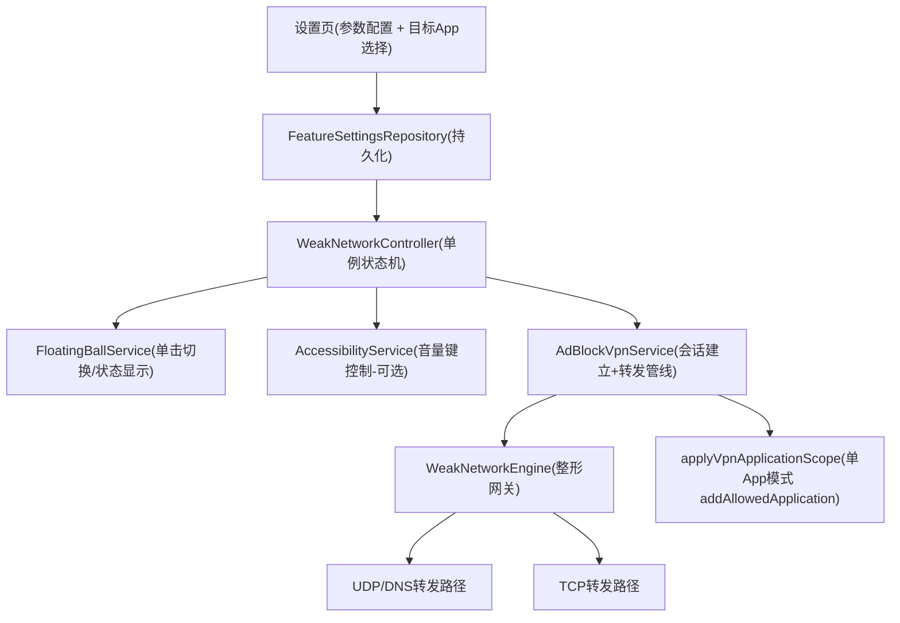

# 弱网模拟功能

Feature Name: weak-network-simulation
Updated: 2026-08-21

## Description

在 HanFeng 广告拦截 APP 中加入弱网模拟能力（对标 QNET）。支持全局与单 App 两种模式，弱网参数在设置页配置，通过悬浮球单击或（可选）音量键快速开/关。弱网整形作用于现有 TUN 转发管线，不新增重打包。

## Architecture

说明：
- `WeakNetworkController` 为状态中枢，读 `FeatureSettingsRepository` 的弱网配置，通知 VPN 服务与悬浮球。
- `WeakNetworkEngine` 挂在 TUN 转发管线内，对匹配目标的全包做延迟注入、丢包、限速、抖动。
- 单 App 模式依赖 `addAllowedApplication(目标包名)` 限定 VPN 会话；全局模式对整个 TUN 流量整形（保持广告拦截）。

## Components and Interfaces

### 1. WeakNetworkController（新，`com.HanFeng.data.WeakNetworkController.kt`）

单例状态机，公开接口：
- `val isEnabled: Boolean`
- `fun toggle(context)`：切换开/关。
- `fun updateParams(context, params, targetPackage?)`：保存配置并热更新运行中的整形。
- `fun restartVpnIfNeeded(context)`：单 App 模式下启用/禁用时触发 VPN 会话重建。
- `fun notifyVpnStateChanged(vpnRunning: Boolean)`：由 VPN 服务回调维护一致性。

### 2. WeakNetworkEngine（新，`com.HanFeng/service/WeakNetworkEngine.kt`）

整形网关，API：
- `fun shouldShape(protocol: Int, dstIp: String, dstPort: Int, srcUidHint: Int?): Boolean`：判断该包是否属于弱网目标（全局模式全部命中；单 App 模式由 VPN 会话限定，天然只收到目标 App 流量）。
- `fun applyDelay(): Unit`：按 `latencyMs ± jitterMs` 同步延迟（在转发线程执行）。
- `fun shouldDrop(): Boolean`：按 `lossPercent` 概率决定丢弃当前包。
- `fun throttleGuard(bytes: Int)`：令牌桶限速（下行/上行独立速率），不足时短暂 sleep。

插装位置（`file: app/src/main/java/com/HanFeng/service/AdBlockVpnService.kt`）：
- UDP/DNS 路径：`writeTunPacket`/`PacketCodec.buildUdpResponse` 写回句柄之前；进站 UDP（客户端→服务器）在读取 packet 后。
- TCP 路径：TCP 会话数据转发循环中。

限制与取舍：
- UDP 丢包直接整包丢弃；TCP 丢包依赖重传机制自然还原真实弱网表现。
- 延迟/抖动用同步 `Thread.sleep`，置于转发线程（非 UI 线程），单同类连接并发数量有限，开销可控。

### 3. AdBlockVpnService 扩展

- 新增 `FullCaptureRoutingSupport.Mode.WEAK_NET_TARGET` 或复用现有 per-app 机制：在 `applyVpnApplicationScope`（`AdBlockVpnService.kt:1130`）中，当 `weakNetEnabled && weakNetTarget != null` 时对目标包名执行 `addAllowedApplication`。
- 会话重建：单 App 弱网状态变化时，调用现有 VPN 重启/失效机制重建会话（广告拦截对其它 App 临时暂停，符合已确认决策）。
- 全局弱网模式：无需重建，直接注入 `WeakNetworkEngine`。

### 4. FloatingBallService 修改

- `attachTouchListener`（`FloatingBallService.kt:416`）中 `ACTION_UP` 非拖拽分支由 `openMainActivity()`（`:446`）改为 `WeakNetworkController.toggle()`。
- 状态显示：弱网生效时，悬浮球 label/value/颜色体现弱网状态（复用 `computeDisplay` 机制）。
- 主界面入口：设置页保留可进入主界面的入口（决策：单击悬浮球不再打开主界面）。

### 5. 音量键开关（可选设置项，**已实现：辅助功能服务方案**）

- 实现方式由 MediaSession 调整为 `WeakNetVolumeKeyAccessibilityService`（`com.HanFeng/service/WeakNetVolumeKeyAccessibilityService.kt`）：原因 compileSdk 36 的 `MediaSession.Callback` 已无 `onAdjustVolume`。
- 服务过滤全局 `VOLUME_UP/VOLUME_DOWN` 抬手事件并调用 `WeakNetworkController.toggle()`，返回 true 阻止系统调节音量；未开启时音量键保持系统默认行为。
- 设置页开启该选项时，若辅助功能未授权会引导跳转系统设置；开关显示以实际授权状态为准（用户可单独在系统里关闭服务）。
- 注：新增辅助功能服务不可导出生效于已签署 APK 的既有限制，仅作为可选增强。

## Data Models

`FeatureSettingsRepository`（PREFS=`feature_settings`）新增字段，沿用现有 `@Volatile` 缓存风格：

| Key | 类型 | 含义 | 范围 |
|-----|------|------|------|
| `weak_net_enabled` | Boolean | 弱网总开关 | true/false |
| `weak_net_target_package` | String? | 目标 App 包名，null=全局模式 | 任意已安装包 |
| `weak_net_latency_ms` | Int | 附加延迟 | 0-5000 |
| `weak_net_jitter_ms` | Int | 抖动 | 0-1000 |
| `weak_net_loss_percent` | Int | 丢包率 | 0-100 |
| `weak_net_down_kbps` | Int | 下行限速，0=不限 | 0-100000 |
| `weak_net_up_kbps` | Int | 上行限速，0=不限 | 0-100000 |
| `weak_net_volume_key` | Boolean | 音量键控制开关 | true/false |

## Implementation Status

> 2026-08-21 全部任务已实现并通过 `:app:assembleDebug` 编译与单元测试（`WeakNetworkEngineTest` 13 例）。
> 与最初设计的两点偏差：
> 1. 音量键控制改用辅助功能服务（见上文组件 5）。
> 2. 参数非法时按钳制而非"拒绝保存"处理（与现有设置页风格一致）。

## Correctness Properties

- 丢包率、延迟、抖动、限速取值在设置页保存时 SHALL 被钳制到合法范围。
- 弱网关闭后 SHALL 无残留延迟/丢包/限速生效（整形网关依据 enabled 立即短路）。
- 单 App 模式下，非目标 App 流量 SHALL 不经过 VPN（`addAllowedApplication` 保证），即不整形也不拦截。
- 目标 App 被卸载后，系统 SHALL 自动清除 `weak_net_target_package` 并回落全局模式，不崩溃。
  - 注：当前版本未实现卸载自动清除（`addAllowedApplication` 遇已卸载包由系统处理，不崩溃）；后续迭代可加开机自检。
- 悬浮球单击切换与状态显示 SHALL 与 `WeakNetworkController` 状态一致。

## Error Handling

| 场景 | 处理 |
|------|------|
| VPN 未激活时开启弱网 | 提示先开启 VPN 服务，弱网挂起待 VPN 就绪后生效 |
| 单 App 会话重建失败 | 回滚为不改变当前 VPN 会话，记录日志并告知用户 |
| 目标 App 已卸载 | 打开设置页/运行时自动清除目标并回落全局模式（当前版本由 addAllowedApplication 兜底，不崩溃） |
| 音量键辅助服务不可用/未授权 | 设置页引导开启；未开启时音量键保持系统默认行为 |
| 参数非法 | 保存时钳制到合法范围并提示 |

## Test Strategy

- 单元测试：`WeakNetworkEngine` 丢包概率、延迟/抖动范围、令牌桶限速阈值与背压上限、引擎开关短路（`WeakNetworkEngineTest`，13 例已通过）。
- 单元测试：`FeatureSettingsRepository` 新字段持久化与非法值钳制。
- 真机集成：开启全局弱网（丢包 20%、延迟 300ms、限速 200kbps）后 `ping` 与测速验证；指定目标 App 后验证其它 App 延迟无变化。
- 回归：广告拦截规则在全局弱网下仍生效；悬浮球单击不再打开主界面且能切换弱网；音量键控制开关符合预期。

## References

- `app/src/main/java/com/HanFeng/service/AdBlockVpnService.kt:1130` - `applyVpnApplicationScope` 现有 per-app `addAllowedApplication` 机制
- `app/src/main/java/com/HanFeng/core/network/FullCaptureRoutingSupport.kt` - 会话路由模式枚举（NONE/LOCAL_PROXY/MITM_APP/MITM_GLOBAL）
- `app/src/main/java/com/HanFeng/service/FloatingBallService.kt:416` - 悬浮球触摸与单击行为
- `app/src/main/java/com/HanFeng/data/FeatureSettingsRepository.kt:8` - 偏好设置存储风格
- `app/src/main/java/com/HanFeng/ui/SettingsActivity.kt` - 设置页「网络弱网模拟」入口与状态描述
- `app/src/main/java/com/HanFeng/ui/WeakNetworkActivity.kt` - 弱网参数设置页（目标 App 选择 + 参数编辑 + 开关）
- `app/src/main/java/com/HanFeng/service/WeakNetVolumeKeyAccessibilityService.kt` - 音量键辅助服务
- `app/src/test/java/com/HanFeng/service/WeakNetworkEngineTest.kt` - 整形引擎单元测试
- `app/src/main/java/com/HanFeng/ui/FloatingBallSettingsActivity.kt:43` - 悬浮球设置页开关模式（新建弱网参数页参照此样式）